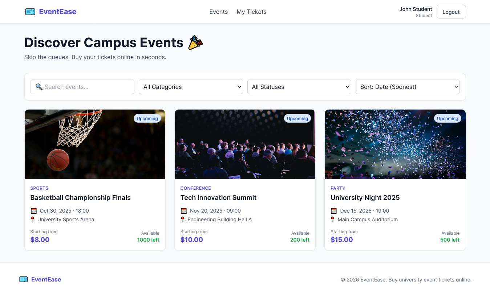
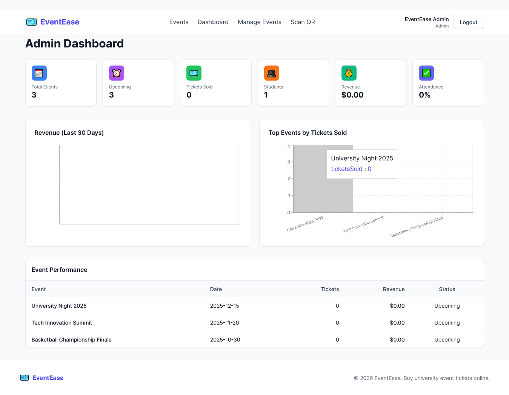

# 🎫 EventEase — Student Event Management & Ticket Booking Platform

A full-stack web application that lets university students discover, book, and pay for campus event tickets online — with digital QR code tickets and admin-side scanning for event entry.


## 🎯 Problem Solved

Students currently wait in long physical queues to buy event tickets. EventEase moves the entire ticket purchase process online:

**Discover → Select → Pay → Get QR Ticket → Scan at Entrance**

## ✨ Features

### For Students
- 🔍 Browse & search campus events
- 🎟️ Filter by category, date, price, availability
- 📄 View detailed event information
- 🛒 Multi-ticket-type booking with quantity selection
- 💳 Secure Stripe payment
- 📱 Digital QR tickets (view/download)
- 📊 Personal dashboard with booking history
- ❌ Cancel eligible bookings

### For Admins / Organizers
- 🔐 Secure admin authentication
- ➕ Create, edit, and delete events
- 🎫 Manage ticket types (Regular, VIP, Early Bird)
- 📈 Real-time dashboard with analytics
- 💰 Revenue tracking with charts
- 👥 View registered students
- 📷 QR code scanner for event entry
- ✅ Duplicate-entry prevention
- 📥 Export bookings as CSV

### Technical Highlights
- ⚡ **Concurrency-safe bookings** — atomic DB transactions prevent overselling
- 🔒 **HMAC-signed QR codes** — tamper-proof ticket validation
- 🛡️ **JWT authentication** with role-based authorization
- 🚦 **Rate limiting** on auth & booking endpoints
- 📧 **Email notifications** (booking confirmation, cancellation, reminders)

## 🛠️ Tech Stack

| Layer | Technology |
|-------|-----------|
| Frontend | React 19 + TypeScript + Vite + Tailwind CSS |
| Backend | Node.js + Express.js |
| Database | MySQL + Sequelize ORM |
| Auth | JWT + bcrypt |
| Payments | Stripe (test mode) |
| QR Codes | `qrcode` (generation) + `html5-qrcode` (scanning) |
| Email | Nodemailer + Mailtrap |
| Charts | Recharts |

## 📁 Project Structure


EventEase/
├── backend/
│ ├── src/
│ │ ├── config/ # DB connection
│ │ ├── models/ # Sequelize models
│ │ ├── controllers/ # Route handlers
│ │ ├── routes/ # API routes
│ │ ├── middleware/ # Auth, validation
│ │ ├── services/ # Business logic
│ │ ├── utils/ # Helpers (QR, etc.)
│ │ └── app.js
│ ├── .env.example
│ └── package.json
├── frontend/
│ ├── src/
│ │ ├── components/ # Reusable UI
│ │ ├── pages/ # Route pages
│ │ ├── contexts/ # Auth context
│ │ ├── services/ # Axios API client
│ │ ├── types/ # TS types
│ │ └── App.tsx
│ ├── .env.example
│ └── package.json
└── README.md


## 🚀 Getting Started

### Prerequisites
- Node.js 18+
- MySQL 8+
- npm or yarn

### 1. Clone the repository

```bash
git clone https://github.com/Dilshan-wijayawardhane/EventEase-Event-Management-System.git
cd EventEase-Event-Management-System
```bash


2. Set up the database
sql

CREATE DATABASE eventease_db;
CREATE USER 'eventease_user'@'localhost' IDENTIFIED BY 'EventEase@2025';
GRANT ALL PRIVILEGES ON eventease_db.* TO 'eventease_user'@'localhost';
FLUSH PRIVILEGES;


3. Backend setup
'''bash

cd backend
npm install
cp .env.example .env    # then edit .env with your DB credentials
npm run seed            # creates tables + demo data
npm run dev             # starts on http://localhost:5000

'''bash

4. Frontend setup
'''bash

cd ../frontend
npm install
cp .env.example .env    # then edit if needed
npm run dev             # starts on http://localhost:5173

'''bash

5. Open the app

Visit http://localhost:5173
🔑 Demo Credentials
Role	Email	Password
Admin	admin@eventease.com	Admin@123
Student	student@eventease.com	Student@123
📡 API Endpoints
Auth

    POST /api/auth/register — Register new student

    POST /api/auth/login — Login (returns JWT)

    GET /api/auth/profile — Get current user

    PUT /api/auth/profile — Update profile

Events

    GET /api/events — List events (with filters)

    GET /api/events/:id — Event details

    POST /api/events — Create event (admin)

    PUT /api/events/:id — Update event (admin)

    DELETE /api/events/:id — Delete event (admin)

Bookings

    POST /api/bookings — Create booking

    GET /api/bookings/my — My bookings

    GET /api/bookings/:id — Booking details

    PATCH /api/bookings/:id/cancel — Cancel booking

Tickets

    GET /api/tickets/my — My tickets

    GET /api/tickets/:id — Ticket details

    POST /api/tickets/validate — Validate QR (admin)

Payments

    POST /api/payments/create-intent — Create Stripe PaymentIntent

    POST /api/payments/webhook — Stripe webhook

Admin

    GET /api/admin/dashboard — Dashboard stats

    GET /api/admin/sales-chart — Sales over time

    GET /api/admin/top-events — Top events

    GET /api/admin/bookings — All bookings

    GET /api/admin/students — All students

    GET /api/admin/events/:id/analytics — Event analytics

    GET /api/admin/bookings/export — CSV export

🔒 Security

    Passwords hashed with bcrypt (12 rounds)

    JWT tokens for stateless auth

    Role-based authorization on all protected routes

    Rate limiting: 20 auth attempts/15min, 10 bookings/min

    Input validation with express-validator

    Helmet.js for secure HTTP headers

    HMAC signature on QR codes to prevent forgery

    Environment variables for all secrets (never hardcoded)

    ACID transactions with row-level locking prevent overselling

🧪 Testing the Critical Flows
Test concurrency safety

Open two browser windows and buy the last ticket simultaneously — only one succeeds.
Test QR validation

    Login as admin → go to /admin/scanner

    Scan a ticket QR code (or paste manually)

    First scan: ✅ Success

    Second scan: ❌ "Already used"

📸 Screenshots






📝 License

MIT © 2025 Dilshan Wijayawardhane
🙏 Acknowledgments

Built as a full-stack portfolio project demonstrating modern web development practices.
